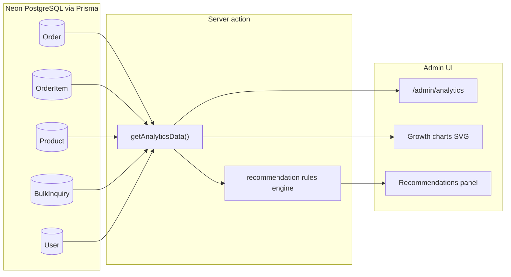

# Admin Analytics Page (real data only)

## Important scope note

There is **no external market/industry API** in this project. "Market growth" on this page means **your Minaliya store's sales growth** computed from live `Order`, `OrderItem`, `Product`, `Category`, `User`, and `BulkInquiry` tables via `DATABASE_URL`. Every number and recommendation will be derived from those records—never hardcoded percentages like the old dashboard had.



---

## Data sources (what we can compute today)

| Metric | Prisma source |
|--------|----------------|
| Monthly revenue | `Order.totalAmount` grouped by `createdAt` month (exclude `CANCELLED`) |
| Monthly order count | `Order.count` per month |
| MoM growth % | Same logic already in [`getAdminDashboardStats`](src/actions/adminData.ts) — reuse `getMonthBounds` + `percentChange` |
| Category revenue share | `OrderItem` joined to `Product.category` |
| Top products | `OrderItem` grouped by `productId`, sum `quantity` and `price * quantity` |
| Avg order value | `total revenue / order count` for selected period |
| New customers | `User` count where first `Order.createdAt` falls in month (or `User.createdAt` as fallback) |
| Bulk demand signals | `BulkInquiry` count + top `product` strings last 30 days |
| Inventory risk | `Product.stock` where `stock <= 10` or `stock === 0` |
| Operational backlog | `Order` where status `PENDING` or `PROCESSING` |

No schema migration required.

---

## 1. Server action — [`src/actions/analytics.ts`](src/actions/analytics.ts) (new)

`getAnalyticsData()` guarded by `requireAdmin()` from [`adminData.ts`](src/actions/adminData.ts).

Returns a typed payload:

```typescript
{
  periodLabel: string; // e.g. "Last 6 months"
  monthlySeries: Array<{
    month: string;       // "Jan 2026"
    revenue: number;
    orders: number;
    avgOrderValue: number;
  }>;
  growth: {
    revenueMoM: number | null;
    ordersMoM: number | null;
    revenueTotal: number;
    ordersTotal: number;
  };
  categoryBreakdown: Array<{ name: string; revenue: number; sharePercent: number }>;
  topProducts: Array<{ name: string; unitsSold: number; revenue: number }>;
  statusBreakdown: Array<{ status: string; count: number }>;
  inventoryAlerts: Array<{ name: string; stock: number; slug: string }>;
  inquiryHighlights: Array<{ product: string; totalQuantity: number; count: number }>;
  recommendations: Array<{
    id: string;
    priority: "high" | "medium" | "low";
    title: string;
    detail: string;
    href: string;
    cta: string;
  }>;
}
```

### Queries (all parallel via `Promise.all`)

- **Last 6 calendar months** of orders: loop months, `aggregate` revenue + `count` per month
- **Category breakdown**: `orderItem.groupBy` or raw query via `findMany` with include (group in JS if groupBy limited)
- **Top 5 products**: aggregate order items in last 6 months
- **Status counts**: `order.groupBy({ by: ['status'], _count })`
- **Low/out-of-stock**: `product.findMany({ where: { stock: { lte: 10 } } })`
- **Recent bulk inquiries**: `bulkInquiry` last 30 days, group by `product` field

### Recommendation engine (rule-based, 100% data-driven)

Generate recommendations only when conditions are true—examples:

| Condition | Recommendation |
|-----------|----------------|
| `pendingOrders > 0` | High: "Process N pending orders" → `/admin/orders?status=active` |
| Product `stock === 0` with sales in last 90 days | High: "Restock [product]" → `/admin/products` |
| `stock <= 10` | Medium: "Low stock on [product]" |
| `revenueMoM < -10%` | Medium: "Revenue declined X% vs last month—review pricing/featured products" |
| `revenueMoM > 15%` | Low: "Revenue up X%—consider promoting [top product]" |
| Bulk inquiries for same product ≥ 2 in 30d | Medium: "Strong bulk demand for [product]" → `/admin/inquiries` |
| One category > 60% revenue share | Low: "[Category] drives most sales—ensure stock coverage" |
| `cancelled` orders > 20% of total | Medium: "High cancellation rate—review checkout flow" |

If no rules fire, show a single neutral card: "Store is healthy—no urgent actions" (still real state, not fake optimism).

---

## 2. Analytics page — [`src/app/admin/(dashboard)/analytics/page.tsx`](src/app/admin/(dashboard)/analytics/page.tsx)

Server component:
- `const data = await getAnalyticsData()`
- Render `<AnalyticsClient data={data} />`
- `export const revalidate = 0`

Uses existing [`loading.tsx`](src/app/admin/(dashboard)/loading.tsx) skeleton during navigation.

---

## 3. Client UI — [`src/components/admin/AnalyticsClient.tsx`](src/components/admin/AnalyticsClient.tsx)

Matches admin light theme (cream/forest, `framer-motion` entrance). Sections:

### A. Growth summary row (interactive cards, reuse pattern from [`InteractiveStatCard`](src/components/admin/InteractiveStatCard.tsx))
- Total revenue (6-month or all-time—label clearly)
- Orders this month + real MoM %
- Avg order value
- Only show trend chips when `revenueMoM` / `ordersMoM` is computable (not null)

### B. Growth charts — [`src/components/admin/GrowthChart.tsx`](src/components/admin/GrowthChart.tsx)
**Pure SVG bar charts** (no new npm dependency; `framer-motion` for bar animation):
- Revenue by month (₹)
- Orders by month (count)
- Responsive: stacked on mobile, side-by-side on `lg+`
- Y-axis labels from actual max values in series (auto-scale)

### C. Category + top products
- Horizontal bar list for category revenue share (real %)
- Ranked table/cards for top 5 products by revenue

### D. Recommendations panel — [`src/components/admin/RecommendationsPanel.tsx`](src/components/admin/RecommendationsPanel.tsx)
- Priority badges (high = amber/red, medium, low)
- Each card links to relevant admin page (`href` + `cta`)
- Empty state only when rules produce zero items

### E. Operational snapshot
- Order status breakdown (real counts)
- Inventory alerts list (real stock numbers)
- Bulk inquiry highlights (real inquiry aggregates)

---

## 4. Navigation integration

Update:
- [`AdminSidebar.tsx`](src/components/admin/AdminSidebar.tsx) — add **Analytics** link with `BarChart3` icon → `/admin/analytics`
- [`AdminLayoutClient.tsx`](src/components/admin/AdminLayoutClient.tsx) — page title mapping
- `ADMIN_ROUTES` prefetch array — include `/admin/analytics`
- Optional: link from dashboard [`QuickActionsPanel`](src/components/admin/QuickActionsPanel.tsx) — "View analytics"

---

## 5. Responsive and performance

- Mobile: single-column layout, charts use full width, touch-friendly recommendation cards
- Desktop: 2-column chart grid + sidebar recommendations
- All queries in one server action (single round-trip to client)
- Exclude `CANCELLED` orders from revenue growth unless showing status breakdown separately
- Handle empty DB gracefully: "Not enough order history yet" with real zero counts—not fake demo data

---

## Files to add / change

| File | Action |
|------|--------|
| [`src/actions/analytics.ts`](src/actions/analytics.ts) | New — all queries + recommendation engine |
| [`src/app/admin/(dashboard)/analytics/page.tsx`](src/app/admin/(dashboard)/analytics/page.tsx) | New route |
| [`src/components/admin/AnalyticsClient.tsx`](src/components/admin/AnalyticsClient.tsx) | New page shell |
| [`src/components/admin/GrowthChart.tsx`](src/components/admin/GrowthChart.tsx) | New SVG charts |
| [`src/components/admin/RecommendationsPanel.tsx`](src/components/admin/RecommendationsPanel.tsx) | New recommendations UI |
| [`src/components/admin/AdminSidebar.tsx`](src/components/admin/AdminSidebar.tsx) | Add nav item + prefetch |
| [`src/components/admin/AdminLayoutClient.tsx`](src/components/admin/AdminLayoutClient.tsx) | Page title |
| [`src/components/admin/QuickActionsPanel.tsx`](src/components/admin/QuickActionsPanel.tsx) | Optional analytics link |

---

## Verification

1. Log in as admin → open `/admin/analytics`
2. Confirm revenue/order numbers match `/admin` dashboard totals
3. Place a test order → refresh analytics → monthly series and recommendations update
4. With zero orders: charts show empty bars, recommendations show inventory/inquiry-only rules (no fake growth %)
5. Resize to mobile: no horizontal scroll on main analytics content

## Out of scope

- External industry/market benchmarks (Google Trends, etc.)
- AI/LLM-generated recommendations
- New database tables or analytics events tracking
- Customer PII export
